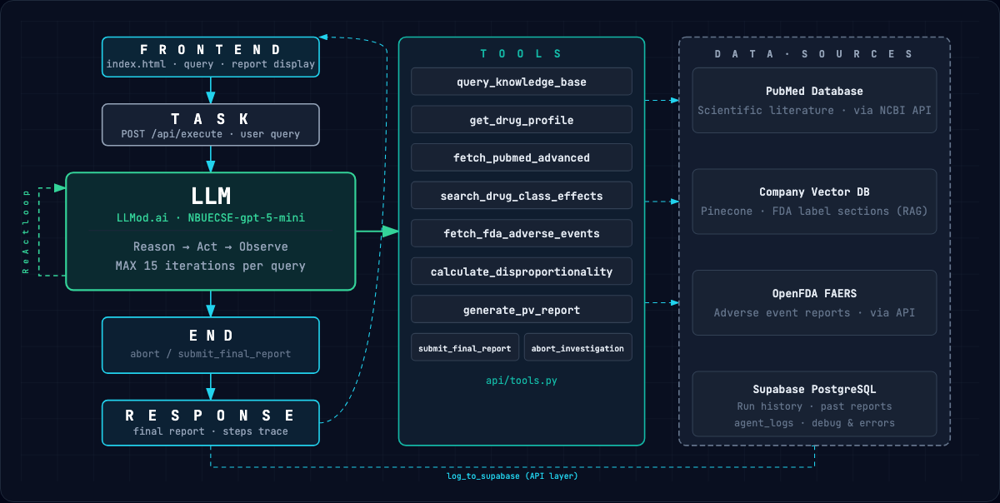

<div align="center">

# VigiLenseAI

**Live demo: [https://vigilense-ai.vercel.app](https://vigilense-ai.vercel.app)**

[Overview](#overview) • [How it works](#how-it-works) • [Getting Started](#getting-started) • [API Reference](#api-reference)

</div>

---

## Overview

### The problem

Every pharmaceutical company is legally required to continuously monitor the safety of its approved drugs — a discipline known as pharmacovigilance. When a potential adverse drug event surfaces (from a patient report, a clinical study, or a regulatory signal), a safety analyst must:

- Search recent medical literature for relevant findings
- Retrieve the current FDA drug label to understand the known risk profile
- Query real-world adverse event databases (such as FDA FAERS) to quantify how frequently the event is reported
- Assess whether the finding constitutes a novel, unexpected signal — or a known, expected one
- Synthesize all of the above into a structured safety report following international standards (CIOMS/ICH E2D)

This process is time-consuming, repetitive, and highly sensitive to human error. A single missed citation or unsupported conclusion can have serious regulatory consequences.

### What was done before

Until now, this work was done almost entirely manually. Analysts would open PubMed in one tab, FDA databases in another, and a Word template in a third — copying, cross-referencing, and writing by hand. Some organizations use rules-based tools that automate parts of the literature search, but none integrate the full pipeline end-to-end, and none can reason about findings the way a trained analyst would.

### Our solution

VigiLenseAI is an autonomous AI agent that conducts the full pharmacovigilance investigation from a single natural-language query. The analyst types what they want to investigate — and the agent searches the literature, retrieves the drug profile, queries FAERS, calculates the statistical signal, and writes the report, all on its own.

The system is designed to operate within a **specific company's drug portfolio**. It only investigates drugs that the company has pre-loaded into its internal knowledge base. If a drug is not in the company's portfolio, the agent refuses the query immediately — ensuring that resources are spent only on drugs the company is actually responsible for monitoring, and that the knowledge base used for comparison is always internally consistent.

### Why this matters

- **Speed** - an investigation that takes an analyst hours is completed in under a minute
- **Consistency** - every report follows the same structure and citation standards, regardless of who ran the query
- **Traceability** - every claim in the report links back to a real source retrieved during the investigation; nothing is inferred or fabricated
- **Scalability** - the same agent can handle hundreds of concurrent investigations without additional headcount
- **Auditability** - every step the agent took is logged and visible, making it easy to review, challenge, or reproduce any finding

## How it works

### The ReAct loop

At the core of VigiLenseAI is a ReAct agent loop implemented in [`api/agent.py`](api/agent.py). When a query arrives, the agent enters an iterative cycle:

1. **Reason** - the LLM reads the current state and decides what to do next
2. **Act** - it calls one of 10 specialized tools
3. **Observe** - the tool result is added to the context
4. Repeat, up to a maximum of 15 iterations

The loop terminates in one of two ways: the agent calls `submit_final_report` when it has gathered enough evidence, or it calls `abort_investigation` if a guardrail condition is met. No result is ever fabricated — every claim in the final report must trace directly to a tool response.

### The tools

At each iteration, the agent reasons about what information it still needs and independently decides which tool to call next. There is no fixed sequence — the agent may search PubMed before or after retrieving the drug profile, may call a tool multiple times with different parameters, or may skip tools that aren't relevant to the specific query. The loop runs for as many iterations as the investigation requires, up to a maximum of 15. If the agent has gathered enough evidence earlier, it ends the investigation before reaching that limit.

The 10 available tools are:

**`query_knowledge_base`** - Performs a semantic vector search (RAG) over a Pinecone index containing FDA label content and safety summaries for the 8 formulary drugs. This is the one tool the agent is always required to call first, to verify the drug is in the portfolio before doing anything else.

**`check_past_signals`** - Queries the Supabase `agent_logs` table to surface any previous investigations on the same drug, so the agent can build on prior findings rather than starting from scratch.

**`get_drug_profile`** - Resolves the drug name against OpenFDA to retrieve the current FDA label: active ingredients, drug class, mechanism of action, and brand names. Falls back to RxNorm for normalization when the OpenFDA lookup is ambiguous.

**`fetch_pubmed_advanced`** - Searches PubMed using boolean query syntax (`"drug" AND ("ae1" OR "ae2")`) and retrieves abstracts from a configurable date range (default: 2020–present). The LLM screens all retrieved abstracts for relevance before they are included.

**`search_drug_class_effects`** - Same as above but searches by drug class rather than by a specific compound name, useful for contextualizing a finding within a broader pharmacological class (e.g. "SGLT2 inhibitors AND ketoacidosis").

**`fetch_fda_adverse_events`** - Queries the OpenFDA FAERS database for real-world case counts for a drug–event pair, returning the 2×2 contingency table values needed for disproportionality analysis.

**`calculate_disproportionality`** - Computes the Reporting Odds Ratio (ROR) and its 95% confidence interval from a 2×2 contingency table. An ROR lower bound above 1 is treated as a potential disproportionate signal.

**`generate_pharmacovigilance_report`** - Assembles the structured Markdown report in CIOMS/ICH E2D format, with sections for the FDA label baseline, novel findings from literature, known/expected findings, and signal assessment. All PubMed citations are rendered as numbered references pointing to real PMIDs retrieved during the investigation.

**`submit_final_report`** - Called by the agent when it has completed the investigation. Terminates the ReAct loop and returns the report to the caller.

**`abort_investigation`** - Terminates the loop early when a guardrail condition is met (see below).

### Guardrails

If the agent cannot conduct a valid investigation, it aborts early with one of 6 codes: `drug_not_in_portfolio`, `drug_not_recognized`, `query_too_vague`, `multiple_drugs_detected`, `non_medical_query`, `no_literature_found`. This prevents the agent from spending resources or producing output on queries it cannot handle responsibly.

### Architecture



The full interactive diagram is available at [`architecture.html`](architecture.html).

| Layer | Technology |
|-------|-----------|
| Frontend | Vanilla HTML/CSS/JS, served by FastAPI |
| Backend | FastAPI + Uvicorn |
| LLM | LLMod.ai (`NBUECSE-gpt-5-mini`, OpenAI-compatible) |
| Vector DB | Pinecone (RAG over FDA label documents) |
| Relational DB | Supabase (PostgreSQL — `agent_logs` table) |
| Deployment | Vercel (`@vercel/python`) |

### Formulary

The bundled knowledge base covers 8 drugs: **Adalimumab**, **Atorvastatin**, **Lisinopril**, **Metformin**, **Methotrexate**, **Sertraline**, **Sildenafil**, and **Warfarin**. Queries about any other drug are rejected at the first step.

---

## Getting Started

### Prerequisites

- Python 3.11+
- [Pinecone](https://pinecone.io/) account with an index named `vigilense`
- [Supabase](https://supabase.com/) project with an `agent_logs` table
- [LLMod.ai](https://llmod.ai/) API key (or any OpenAI-compatible endpoint)

### Local setup

1. Clone the repository:

   ```bash
   git clone https://github.com/aviad-alon/VigiLense-AI.git
   cd VigiLense-AI
   ```

2. Create a virtual environment and install dependencies:

   ```bash
   python -m venv .venv
   source .venv/bin/activate   # Windows: .venv\Scripts\activate
   pip install -r requirements.txt
   ```

3. Create a `.env` file at the project root (see [Environment variables](#environment-variables) below).

4. (First run only) Seed the Pinecone knowledge base with the bundled drug profiles:

   ```bash
   python seed_db.py
   ```

5. Start the development server:

   ```bash
   uvicorn api.index:app --reload
   ```

   The app is now available at `http://localhost:8000`.

> [!NOTE]
> If you ever need to rebuild the Pinecone index from scratch (e.g. after changing the embedding model), run `python recreate_index.py` before re-running `seed_db.py`.

### Environment variables

| Variable | Description |
|----------|-------------|
| `OPENAI_API_KEY` | API key for the LLM endpoint |
| `OPENAI_BASE_URL` | Base URL of the OpenAI-compatible API (default: `https://api.llmod.ai`) |
| `PINECONE_API_KEY` | Pinecone API key |
| `PINECONE_INDEX_NAME` | Pinecone index name (default: `vigilense`) |
| `SUPABASE_URL` | Supabase project URL |
| `SUPABASE_SECRET_KEY` | Supabase service role (secret) key |

### Project structure

```
├── api/
│   ├── index.py          # FastAPI app - all HTTP routes and data models
│   ├── agent.py          # ReAct loop, system prompt, citation integrity scrubber
│   ├── tools.py          # 10 pharmacovigilance tools
│   ├── config.py         # Shared SDK clients (OpenAI, Pinecone, Supabase)
│   └── architecture.png  # Architecture diagram (served at /api/model_architecture)
├── data/                 # Drug profile JSON files used to seed Pinecone
├── tests/                # End-to-end test suite
├── index.html            # Single-page frontend
├── architecture.html     # Interactive architecture diagram
├── seed_db.py            # Seeds Pinecone with drug profile data
├── recreate_index.py     # Recreates the Pinecone index
├── requirements.txt
└── vercel.json           # Vercel deployment configuration
```

---

## API reference

| Method | Path | Description |
|--------|------|-------------|
| `GET` | `/` | Serves the frontend |
| `POST` | `/api/execute` | Run the ReAct agent on a query |
| `GET` | `/api/agent_info` | Agent description, purpose, and prompt examples |
| `GET` | `/api/team_info` | Team details |
| `GET` | `/api/model_architecture` | Architecture diagram (`image/png`) |
| `GET` | `/api/history` | Recent investigations from Supabase |

### POST /api/execute

**Request body:**
```json
{
  "prompt": "Review the latest PubMed findings on Metformin and lactic acidosis for novel signals."
}
```

**Response:**
```json
{
  "report_markdown": "## Pharmacovigilance Report - Metformin ...",
  "reasoning": null,
  "steps": [
    { "step": 1, "thought": "...", "action": "query_knowledge_base", "observation": "..." },
    { "step": 2, "thought": "...", "action": "fetch_pubmed_advanced",  "observation": "..." }
  ]
}
```

If the agent triggers a guardrail, `report_markdown` is `null` and `reasoning` contains the abort message and code.

## Resources

- [PubMed API](https://www.ncbi.nlm.nih.gov/home/develop/api/) - biomedical literature retrieval
- [OpenFDA API](https://open.fda.gov/apis/) - drug labels and FAERS adverse event database
- [RxNorm API](https://lhncbc.nlm.nih.gov/RxNav/APIs/RxNormAPIs.html) - drug name normalization
- [ICH E2D Guideline](https://www.ich.org/page/pharmacovigilance-guidelines) - post-approval pharmacovigilance reporting standard
- [ReAct: Synergizing Reasoning and Acting in Language Models](https://arxiv.org/abs/2210.03629) - the agent architecture this project is based on
