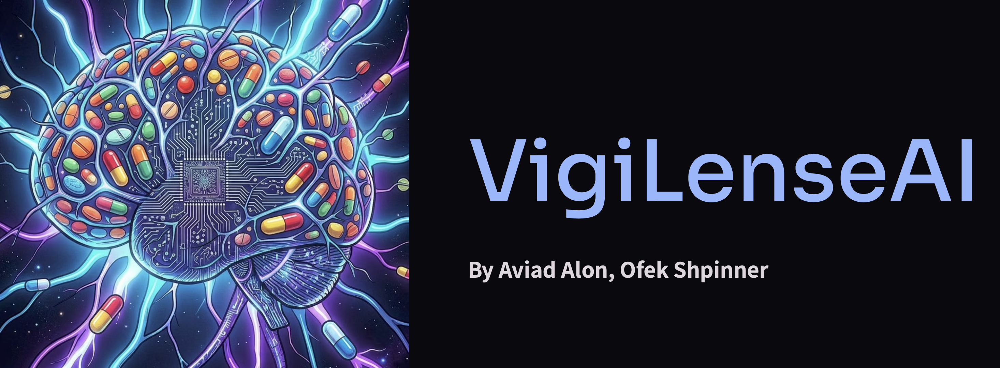

<div align="center">



**Live demo: [https://vigilense-ai.vercel.app](https://vigilense-ai.vercel.app)**

[Overview](#overview) • [How it works](#how-it-works) • [Getting Started](#getting-started) • [API Reference](#api-reference)

</div>

---

## Overview

### The problem

Once a drug reaches the market, the regulatory obligation doesn't end - it shifts. Companies are legally required to continuously monitor their approved drugs for safety issues that may not have appeared during clinical trials. This is called post-market surveillance, and it means that someone on the safety team must regularly search the medical literature for new findings, case reports, or signals that could indicate a previously unknown risk.

This work falls on a dedicated team that does it manually and continuously. It's slow, repetitive, and prone to human error. These teams are expensive to maintain, and the cost of getting it wrong - a missed signal, a delayed report - can mean regulatory penalties or legal liability.

With the rise of AI, there's a clear opportunity to automate the most repetitive parts of this work and let safety professionals focus on decisions rather than data gathering.

### Our solution

VigiLenseAI is an AI agent that runs the full investigation from a single query. You type what you want to look into, and the agent handles the rest: searching PubMed, retrieving the drug profile, querying FAERS, calculating the signal strength, and generating a structured report.

It only works with drugs that belong to the company's portfolio. If a drug isn't in the knowledge base, the agent says so immediately and stops.

### Why it's useful

- **Faster** - what used to take hours is completed in a fraction of the time
- **Consistent** - every report follows the same structure, every time
- **Traceable** - every claim in the report links to a real source retrieved during the run
- **Transparent** - every step the agent took is logged and visible

## How it works

### The ReAct loop

At the core of VigiLenseAI is a ReAct agent loop implemented in [`api/agent.py`](api/agent.py). When a query arrives, the agent enters an iterative cycle:

1. **Reason** - the LLM reads the current state and decides what to do next
2. **Act** - it calls one of 9 specialized tools
3. **Observe** - the tool result is added to the context
4. Repeat, up to a maximum of 20 iterations

The loop terminates in one of two ways: the agent calls `submit_final_report` when it has gathered enough evidence, or it calls `abort_investigation` if a guardrail condition is met. No result is ever fabricated -every claim in the final report must trace directly to a tool response.

### The tools

At each iteration, the agent reasons about what information it still needs and independently decides which tool to call next. There is no fixed sequence -the agent may search PubMed before or after retrieving the drug profile, may call a tool multiple times with different parameters, or may skip tools that aren't relevant to the specific query. The loop runs for as many iterations as the investigation requires, up to a maximum of 20. If the agent has gathered enough evidence earlier, it ends the investigation before reaching that limit.

The 9 available tools are:

**`query_knowledge_base`** - Performs a semantic vector search (RAG) over a Pinecone index containing FDA label content and safety summaries for the 8 formulary drugs. The agent is always required to call this first - both to confirm the drug is in the portfolio and to retrieve internal knowledge about it (known risks, mechanism, label baseline) before searching external sources.

**`get_drug_profile`** - Resolves the drug name against OpenFDA to retrieve the current FDA label: active ingredients, drug class, mechanism of action, and brand names. Falls back to RxNorm for normalization when the OpenFDA lookup is ambiguous.

**`fetch_pubmed_advanced`** - Searches PubMed using boolean query syntax (`"drug" AND ("ae1" OR "ae2")`) and retrieves abstracts from a configurable date range (default: 2020–present). The LLM screens all retrieved abstracts for relevance before they are included.

**`search_drug_class_effects`** - Same as above but searches by drug class rather than by a specific compound name, useful for contextualizing a finding within a broader pharmacological class (e.g. "SGLT2 inhibitors AND ketoacidosis").

**`fetch_fda_adverse_events`** - Queries the OpenFDA FAERS database to retrieve real-world reporting counts for a specific drug–event pair. FAERS aggregates adverse event reports submitted by patients, clinicians, and manufacturers worldwide. The tool returns the raw counts needed to assess how often this event is reported for this drug compared to all other drugs in the database.

**`calculate_disproportionality`** - Takes the counts from FAERS and computes the Reporting Odds Ratio (ROR) with a 95% confidence interval. The purpose is to give statistical weight to a finding: if an adverse event showed up in the literature, this tool answers whether it's also reported disproportionately in real-world data - and with enough statistical confidence to treat it as a signal worth flagging. An ROR lower bound above 1 suggests the event is reported more than would be expected by chance.

**`generate_pharmacovigilance_report`** - Assembles the structured Markdown report in CIOMS/ICH E2D format, with sections for the FDA label baseline, novel findings from literature, known/expected findings, and signal assessment. All PubMed citations are rendered as numbered references pointing to real PMIDs retrieved during the investigation.

**`submit_final_report`** - Called by the agent when it has completed the investigation. Terminates the ReAct loop and returns the report to the caller.

**`abort_investigation`** - Terminates the loop early when a guardrail condition is met (see below).

### Guardrails

If the agent cannot conduct a valid investigation, it aborts early with one of 6 codes: `drug_not_in_portfolio`, `drug_not_recognized`, `query_too_vague`, `multiple_drugs_detected`, `non_medical_query`, `no_literature_found`. This prevents the agent from spending resources or producing output on queries it cannot handle responsibly.

### Architecture


The full interactive diagram is available at [`architecture.html`](architecture.html).

| Layer | Technology |
|-------|-----------|
| Frontend | Vanilla HTML/CSS/JS, served by FastAPI |
| Backend | FastAPI + Uvicorn |
| LLM | LLMod.ai (`NBUECSE-gpt-5-mini`, OpenAI-compatible) |
| Vector DB | Pinecone (RAG over FDA label documents) |
| Relational DB | Supabase (PostgreSQL -`agent_logs` table) |
| Deployment | Vercel (`@vercel/python`) |

### Formulary

The bundled knowledge base covers 8 drugs: **Adalimumab**, **Atorvastatin**, **Lisinopril**, **Metformin**, **Methotrexate**, **Sertraline**, **Sildenafil**, and **Warfarin**. Queries about any other drug are rejected at the first step.

---

## Getting Started

### Prerequisites

- Python 3.11+
- [Pinecone](https://pinecone.io/) account with an index named `vigilense`
- [Supabase](https://supabase.com/) project with an `agent_logs` table
- [LLMod.ai](https://llmod.ai/) API key (or any OpenAI-compatible endpoint)

### Local setup

1. Clone the repository:

   ```bash
   git clone https://github.com/aviad-alon/VigiLense-AI.git
   cd VigiLense-AI
   ```

2. Create a virtual environment and install dependencies:

   ```bash
   python -m venv .venv
   source .venv/bin/activate   # Windows: .venv\Scripts\activate
   pip install -r requirements.txt
   ```

3. Create a `.env` file at the project root (see [Environment variables](#environment-variables) below).

4. (First run only) Seed the Pinecone knowledge base with the bundled drug profiles:

   ```bash
   python seed_db.py
   ```

5. Start the development server:

   ```bash
   uvicorn api.index:app --reload
   ```

   The app is now available at `http://localhost:8000`.

> [!NOTE]
> If you ever need to rebuild the Pinecone index from scratch (e.g. after changing the embedding model), run `python recreate_index.py` before re-running `seed_db.py`.

### Environment variables

| Variable | Description |
|----------|-------------|
| `OPENAI_API_KEY` | API key for the LLM endpoint |
| `OPENAI_BASE_URL` | Base URL of the OpenAI-compatible API (default: `https://api.llmod.ai`) |
| `PINECONE_API_KEY` | Pinecone API key |
| `PINECONE_INDEX_NAME` | Pinecone index name (default: `vigilense`) |
| `SUPABASE_URL` | Supabase project URL |
| `SUPABASE_SECRET_KEY` | Supabase service role (secret) key |

### Project structure

```
├── api/
│   ├── index.py          # FastAPI app - all HTTP routes and data models
│   ├── agent.py          # ReAct loop, system prompt, citation integrity scrubber
│   ├── tools.py          # 9 pharmacovigilance tools
│   ├── config.py         # Shared SDK clients (OpenAI, Pinecone, Supabase)
│   └── architecture.png  # Architecture diagram (served at /api/model_architecture)
├── data/                 # Drug profile JSON files used to seed Pinecone
├── tests/                # End-to-end test suite
├── index.html            # Single-page frontend
├── architecture.html     # Interactive architecture diagram
├── seed_db.py            # Seeds Pinecone with drug profile data
├── recreate_index.py     # Recreates the Pinecone index
├── requirements.txt
└── vercel.json           # Vercel deployment configuration
```

---

## API reference

| Method | Path | Description |
|--------|------|-------------|
| `GET` | `/` | Serves the frontend |
| `POST` | `/api/execute` | Run the ReAct agent on a query |
| `GET` | `/api/agent_info` | Agent description, purpose, and prompt examples |
| `GET` | `/api/team_info` | Team details |
| `GET` | `/api/model_architecture` | Architecture diagram (`image/png`) |
| `GET` | `/api/history` | Recent investigations from Supabase |

### POST /api/execute

**Request body:**
```json
{
  "prompt": "Review the latest PubMed findings on Metformin and lactic acidosis for novel signals."
}
```

**Response:**
```json
{
  "report_markdown": "## Pharmacovigilance Report - Metformin ...",
  "reasoning": null,
  "steps": [
    { "step": 1, "thought": "...", "action": "query_knowledge_base", "observation": "..." },
    { "step": 2, "thought": "...", "action": "fetch_pubmed_advanced",  "observation": "..." }
  ]
}
```

If the agent triggers a guardrail, `report_markdown` is `null` and `reasoning` contains the abort message and code.

## Resources

- [PubMed API](https://www.ncbi.nlm.nih.gov/home/develop/api/) - biomedical literature retrieval
- [OpenFDA API](https://open.fda.gov/apis/) - drug labels and FAERS adverse event database
- [RxNorm API](https://lhncbc.nlm.nih.gov/RxNav/APIs/RxNormAPIs.html) - drug name normalization
- [ICH E2D Guideline](https://www.ich.org/page/pharmacovigilance-guidelines) - post-approval pharmacovigilance reporting standard
- [ReAct: Synergizing Reasoning and Acting in Language Models](https://arxiv.org/abs/2210.03629) - the agent architecture this project is based on
